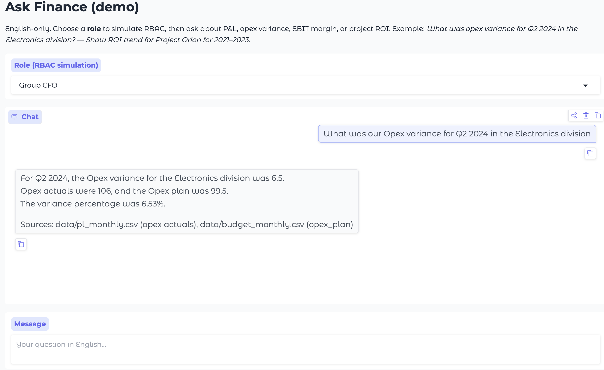

# Ask Finance (AI Agent Prototype)

Finance-domain AI agent demo using `gemini-2.5-flash`, mock SAP/HFM-like data, role-based access control (RBAC), and a Gradio UI.

## Additional Documents

- `docs/ASK_FINANCE_SUBMISSION.md` — **all-in-one case-study document** (export to PDF for your submission; GitHub link placeholders inside).

- `docs/ARCHITECTURE.md`:
    - Describe your system’s architecture and workflow.
    - Explain how the system ensures security and accuracy.
    - Include diagrams or examples of queries and expected outputs.

- `docs/FUTURE.md`:
    - Future plan suggest how this system could scale across BUs, integrate real SAP connectors, or use embeddings for finance knowledge.

- `data/README.md`:
    - Mock data description.


## What this prototype covers

- English-only Q&A for finance prompts (P&L, opex variance, EBIT margin trend, project ROI trend).
- Mock data ingestion from `data/`.
- Simulated RBAC by role (`Group CFO`, `Electronics GM`, `APAC Analyst`).
- Explainable responses driven by tool outputs with data source citation.
- Export from latest run to Excel and PowerPoint.
- Structured logging for debugging in `logs/ask_finance.log`.

## Tech stack

- LLM: `gemini-2.5-flash` via `google-genai` + Vertex AI.
- Backend API: FastAPI + Uvicorn (`src/ask_finance/api.py`).
- UI: Gradio (`app.py`) — talks to the backend over HTTP via `httpx`.
- Data layer: `pandas`.
- Optional exports: `openpyxl`, `python-pptx`.

## Project layout

- `app.py`: Gradio UI entrypoint (HTTP client to the backend; no direct agent imports).
- `src/ask_finance/api.py`: FastAPI backend exposing `/ask`, `/tools/{name}`, `/roles`, `/health`.
- `src/ask_finance/api_client.py`: HTTP client used by the UI.
- `Dockerfile`, `requirements-backend.txt`, `.dockerignore`: backend container image for Cloud Run.
- `.github/workflows/deploy-backend.yml`: CI/CD pipeline (build → push → deploy).
- `infra/terraform/`: GCP infrastructure (APIs, Artifact Registry, IAM, Workload Identity Federation, Cloud Run service).
- `src/ask_finance/config.py`: model, token/thinking caps, env and paths.
- `src/ask_finance/gemini.py`: Vertex client and generation config.
- `src/ask_finance/agent.py`: multi-turn manual tool-calling loop.
- `src/ask_finance/tools.py`: whitelisted finance tools.
- `src/ask_finance/fallback.py`: deterministic tool fallback when the LLM emits no function call.
- `src/ask_finance/rbac.py`: role-based filtering.
- `src/ask_finance/data_loaders.py`: mock data loading.
- `src/ask_finance/logging_setup.py`: rotating logging setup.
- `data/`: synthetic datasets and role map.
- `docs/ARCHITECTURE.md`: architecture + evaluation strategy.

## Setup

1. Create and activate a virtual environment.
2. Install deps:
   - `pip install -r requirements.txt`
   - or `pip install -e .`
3. Ensure credentials are available:
   - default path: `authen/service-account.json`
   - or set `GOOGLE_APPLICATION_CREDENTIALS` to another path.

## Runtime config

Supported env vars:

- `GOOGLE_CLOUD_PROJECT` or `GOOGLE_PROJECT_ID`
- `VERTEX_LOCATION` (default `us-central1`)
- `ASK_FINANCE_MODEL` (default `gemini-2.5-flash`)
- `ASK_FINANCE_MAX_OUTPUT_TOKENS` (default `4096`)
- `ASK_FINANCE_THINKING_BUDGET` (default `0`)
- `ASK_FINANCE_TEMPERATURE` (default `0.2`)
- `ASK_FINANCE_MAX_AGENT_TURNS` (default `12`)
- `ASK_FINANCE_API_URL` (default `http://localhost:8000`) — backend URL the UI calls.
- `ASK_FINANCE_API_TIMEOUT` (default `120`) — HTTP timeout (seconds) for backend calls.
- `ASK_FINANCE_DATA_DIR` (optional) — absolute path to the `data/` folder. Useful when the package is installed non-editable and the auto-detected `data/` is wrong (e.g. `FileNotFoundError: .../python3.X/data/pl_monthly.csv`). Default: walk up from the source file looking for a sibling `data/`, then fall back to `cwd/data`.
- `ASK_FINANCE_LOGS_DIR` (optional) — where Excel/PPT exports and the rotating log file are written. Default: `<repo>/logs`.
- `ASK_FINANCE_REPO_ROOT` (optional) — pin the repo root explicitly; rarely needed.

## Run

The app is split into two processes — a FastAPI **backend** and a Gradio **UI**.

1. Start the backend (loads data + holds the Gemini client):

   ```bash
   uvicorn ask_finance.api:app --host 0.0.0.0 --port 8000
   ```

   Docs are available at `http://localhost:8000/docs`. Key endpoints:
   - `GET /health` — readiness + project/model info.
   - `GET /roles` — RBAC role list.
   - `POST /ask` — `{role, message}` → `{answer, tool_trace, request_id, latency_s, fallback_used}`.
   - `POST /tools/{name}` — `{role, args}` → tool result (whitelisted tools only).

2. In a second terminal, start the Gradio UI:

   ```bash
   python app.py
   ```

   Open the Gradio URL printed in the terminal. If the backend is on a different host, set `ASK_FINANCE_API_URL` before launching the UI.



## Docker & Cloud Run (backend)

The backend ships as a small container (FastAPI + Uvicorn) that listens on `$PORT` (default `8080`) — the contract Cloud Run expects. The UI is **not** part of the image; it stays as a local Gradio app pointed at the deployed URL via `ASK_FINANCE_API_URL`.

### Build locally

```bash
docker build -t ask-finance-api:local .

# Smoke test (local credentials mounted, ADC-style)
docker run --rm -p 8080:8080 \
  -e GOOGLE_CLOUD_PROJECT="$GOOGLE_CLOUD_PROJECT" \
  -e VERTEX_LOCATION="us-central1" \
  -v "$PWD/authen:/secrets:ro" \
  -e GOOGLE_APPLICATION_CREDENTIALS=/secrets/service-account.json \
  ask-finance-api:local
# → curl http://localhost:8080/health
```

The image bundles `data/` at `/app/data` (`ASK_FINANCE_DATA_DIR=/app/data`). Secrets are explicitly excluded by `.dockerignore`; mount them at runtime instead.

### Push to Google Artifact Registry

```bash
export PROJECT_ID="your-gcp-project"
export REGION="us-central1"
export REPO="ask-finance"
export IMAGE="ask-finance-api"
export TAG="$(git rev-parse --short HEAD)"
export AR_HOST="${REGION}-docker.pkg.dev"
export IMAGE_URI="${AR_HOST}/${PROJECT_ID}/${REPO}/${IMAGE}:${TAG}"

# One-time setup
gcloud artifacts repositories create "$REPO" \
  --repository-format=docker \
  --location="$REGION" \
  --description="Ask Finance backend images"
gcloud auth configure-docker "$AR_HOST"

# Build for linux/amd64 (Cloud Run runs amd64) and push
docker buildx build --platform linux/amd64 -t "$IMAGE_URI" --push .
```

### Deploy to Cloud Run

```bash
gcloud run deploy ask-finance-api \
  --image "$IMAGE_URI" \
  --region "$REGION" \
  --platform managed \
  --port 8080 \
  --memory 1Gi \
  --cpu 1 \
  --min-instances 0 \
  --max-instances 4 \
  --service-account "ask-finance-runtime@${PROJECT_ID}.iam.gserviceaccount.com" \
  --set-env-vars "GOOGLE_CLOUD_PROJECT=${PROJECT_ID},VERTEX_LOCATION=${REGION},ASK_FINANCE_MODEL=gemini-2.5-flash" \
  --allow-unauthenticated
```

Notes:
- The runtime service account needs at least `roles/aiplatform.user` (Vertex AI User) on the project. With a service account attached, the container picks up Application Default Credentials automatically — no key file required.
- For internal-only access drop `--allow-unauthenticated` and call the service with an ID token.
- Point the local UI at the deployed backend with `ASK_FINANCE_API_URL=https://ask-finance-api-XXXX.a.run.app python app.py`.

## Infrastructure-as-Code & CI/CD

Production deployment is automated end-to-end:

- **`infra/terraform/`** — provisions APIs, Artifact Registry, runtime + CI service accounts, Workload Identity Federation (GitHub OIDC, **no JSON keys**), and the Cloud Run service stub. See `infra/terraform/README.md` for the apply workflow.
- **`.github/workflows/deploy-backend.yml`** — on push to `main` (or manual dispatch), authenticates to GCP via WIF, builds the image with Buildx, pushes both a `:<sha>` and a `:latest` tag to Artifact Registry, then `gcloud run services update --image=…` rolls the existing service forward. A `/health` smoke test gates success.

The split is deliberate: **Terraform owns the service shape** (env vars, scaling, IAM, runtime SA), **CI owns only the image**. `lifecycle.ignore_changes` on the container image keeps the two from fighting.

Bootstrap once after `terraform apply`:

```bash
terraform -chdir=infra/terraform output -json github_actions_variables
# Copy values into the repo's Settings -> Secrets and variables -> Actions -> Variables:
#   GCP_PROJECT_ID, GCP_REGION, WIF_PROVIDER, WIF_SERVICE_ACCOUNT, CLOUD_RUN_SERVICE_ACCOUNT
```

After that, every push to `main` ships the backend.

## Example prompts

- `What was our Opex variance for Q2 2024 in the Electronics division?`
- `Show me the ROI trend of Project Orion over the last 3 years.`
- `Summarize this month's P&L highlights for APAC.`

## Cost-control settings

The app caps generation cost/verbosity by:

- `max_output_tokens` (hard cap per model call),
- `thinking_budget` (set low/zero),
- `MAX_AGENT_TURNS` (caps tool-loop turns).

## Evaluation strategy (no unit tests in this phase)

This phase intentionally does **not** include automated unit tests.  
Evaluation is documented in `docs/ARCHITECTURE.md` as an AI/ML test plan:

- end-to-end golden scenarios,
- per-step model assessment (intent/tool-choice, numeric grounding, RBAC compliance, explanation quality),
- human scoring rubric and repeatability guidance.

