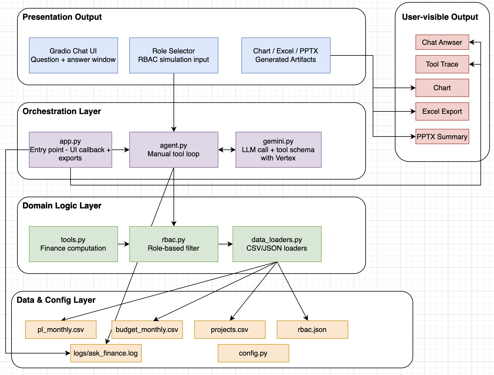

# Ask Finance – Architecture and Evaluation

## 1) Goal

Build an AI Finance Assistant prototype that can:

- understand finance terms and user prompts,
- answer in natural language using mock enterprise finance data,
- enforce role-based data visibility,
- explain outputs with traceable sources,
- support practical outputs (chat + exports).

## 2) High-level architecture (visual)

The visual groups the system into four layers (Presentation, Orchestration, Domain Logic, Data/Config), and also shows output channels (chat answer, tool trace, chart, Excel, and PowerPoint).

## 3) Core components

- `app.py`
  - Gradio UI, role selection, chat interaction.
  - Export latest result to Excel and PowerPoint.
  - Renders debug tool trace and trend chart (when available).

- `src/ask_finance/config.py`
  - Default credentials path: `authen/service-account.json`.
  - Model/cost controls: `ASK_FINANCE_MAX_OUTPUT_TOKENS`, `ASK_FINANCE_THINKING_BUDGET`, `ASK_FINANCE_MAX_AGENT_TURNS`.

- `src/ask_finance/data_loaders.py`
  - Loads `pl_monthly.csv`, `budget_monthly.csv`, `projects.csv`, and `rbac.json`.

- `src/ask_finance/rbac.py`
  - Applies server-side role filters by BU/region.
  - Unknown role returns empty data.

- `src/ask_finance/tools.py`
  - Whitelisted tool functions only:
    - `list_accessible_scope`
    - `get_opex_variance`
    - `get_ebit_margin_trend`
    - `get_pl_summary`
    - `get_project_roi_trend`
  - Each tool returns metrics plus `sources`.

- `src/ask_finance/gemini.py`
  - Vertex `google.genai.Client(vertexai=True, ...)`.
  - `GenerateContentConfig` with:
    - `max_output_tokens`
    - `thinking_budget`
    - safety settings
    - tool declarations (`parameters_json_schema`)
  - AFC is disabled intentionally in code; tool loop is controlled manually in the agent.

- `src/ask_finance/agent.py`
  - Manual multi-turn function-calling loop:
    - Send user prompt + role context.
    - Parse function calls from model response.
    - Execute local tool handlers.
    - Return function responses to model.
    - Stop on final text or turn cap.
  - Captures per-tool trace and latency.

## 4) Security and compliance posture (prototype)

- RBAC enforcement is server-side in tool execution.
- No direct SQL or arbitrary code execution from model output.
- Data scope is limited to local mock CSV/JSON files.
- Logs include operational telemetry (request id, tool usage, errors) for debugging.
- Service account path is configurable; avoid committing secrets in shared repos.

## 5) Data model assumptions

- P&L actuals and budget are joinable by time and business dimensions.
- ROI in this prototype uses:
  - `cumulative_roi = cumulative_benefit_musd / cumulative_investment_musd`.
- Currency in mock data is USD for simplicity.

## 6) Prompting/orchestration strategy

- The system instruction enforces:
  - English-only answers,
  - grounding to tool outputs only,
  - explicit mention of filters/time period,
  - a `Sources:` footer.
- Role is passed in-context and enforced again in tools.

## 7) Logging and observability

- `logs/ask_finance.log` via rotating file handler.
- Logged fields include:
  - request id,
  - role,
  - agent turn number,
  - tool name and timing,
  - model/tool exceptions.

## 8) AI/ML evaluation strategy (test plan, no unit tests in this phase)

This phase focuses on **evaluation strategy**, not automated unit tests.

### 8.1 End-to-end evaluation (full flow)

For a fixed set of golden prompts and roles, evaluate:

- correctness of requested metric,
- correctness of applied scope (BU/region/time),
- source citation presence and relevance,
- response coherence and business readability.

Suggested golden prompts:

1. `What was our Opex variance for Q2 2024 in the Electronics division?`
2. `Show me the ROI trend of Project Orion over the last 3 years.`
3. `Summarize this month's P&L highlights for APAC.`

For each prompt, run at least 3 role variants and verify role-consistent outcomes.

### 8.2 Per-step AI evaluation

Evaluate each AI-reliant step independently:

1. **Intent and tool selection**
   - Did model choose the correct tool(s)?
   - Did it send correct arguments (year, quarter, BU, region)?

2. **Numeric grounding**
   - Are final answer numbers exactly consistent with tool responses?
   - Any hallucinated values or missing units?

3. **RBAC semantic behavior**
   - Does narrative remain within allowed scope for selected role?
   - Are denied scopes avoided or clearly stated as inaccessible/no data?

4. **Explanation quality**
   - Does it explain variance/ROI definitions correctly?
   - Does it include time period and filter assumptions?

5. **Failure handling**
   - If no rows/error, does answer explain limits clearly without fabrication?

### 8.3 Scoring rubric

Use human scoring per test case (0/1/2):

- 0 = fail (incorrect or unsafe),
- 1 = partial (some issues),
- 2 = pass (correct and well-explained).

Track dimensions:

- metric accuracy,
- role compliance,
- source quality,
- explanation quality,
- consistency across repeated runs.

### 8.4 Repeatability and cost checks

- Run each golden case multiple times under fixed temperature.
- Compare consistency of tool choice and numerical narration.
- Record token/cost proxy metrics from logs and model metadata (if exposed).

## 9) Future enhancements

- Enable AFC mode if desired for SDK-managed function loop.
- Add deterministic unit/integration tests around tool outputs and RBAC.
- Replace mock files with SAP/HFM connectors and enterprise data platform access.
- Add chart-first and slide narrative templates for management reporting.

