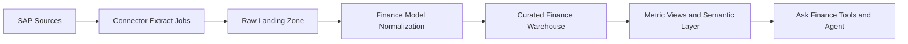
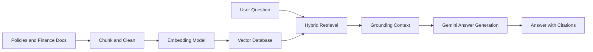

# Ask Finance – Future Roadmap

This document outlines how the prototype can evolve into an enterprise-ready Finance AI platform across multiple BUs, real SAP/HFM integrations, and embedding-powered knowledge.

## 1) Scale across business units (BUs)

### 1.1 Multi-tenant architecture

- Introduce a clear tenant model: `group -> BU -> region -> legal_entity -> cost_center`.
- Partition data and metadata by tenant boundary (physical or logical separation).
- Add tenant-aware request context to every service call and query path.

### 1.2 Data and compute scaling

- Move from local CSV to managed storage + warehouse (for example object storage + BigQuery/Snowflake/Databricks).
- Precompute common finance aggregates (monthly P&L rollups, variance cubes, ROI snapshots) to reduce response latency.
- Use async job queues for heavy requests (large exports, broad multi-year analysis).
- Add cache tiers:
  - short-lived query cache,
  - semantic cache for repeated Q&A,
  - materialized metrics cache for common executive dashboards.

### 1.3 Federated governance

- Define a central finance semantic layer (metric definitions for EBIT, Opex variance, ROI, cash flow).
- Maintain BU-specific overrides with approval workflows (e.g. local chart of accounts mapping).
- Add data quality checks per BU and publish scorecards (freshness, completeness, reconciliation status).

## 2) Integrate real SAP connectors

### 2.1 Connector strategy

- Start with read-only ingestion from SAP/EPM systems:
  - SAP S/4HANA (financial postings, controlling, cost centers),
  - SAP BW/4HANA (analytics views),
  - SAP Group Reporting / BPC / SAC exports (if present).
- Implement connector abstraction so each source has the same contract:
  - `extract`,
  - `normalize`,
  - `validate`,
  - `publish`.

### 2.2 Recommended ingestion pattern

- Use incremental loads (CDC or delta by posting date/document id) to minimize load windows.
- Keep full audit lineage from SAP document IDs to model response citations.

### 2.3 Security and compliance for SAP integration

- Use service principals/technical users with least privilege.
- Centralize secrets in a vault; avoid static keys in repos.
- Enforce encryption in transit/at rest.
- Add immutable audit logs for:
  - who asked,
  - what data slices were accessed,
  - which source records were cited.

## 3) Use embeddings for finance knowledge

### 3.1 What to embed

- Finance policy documents (accounting policies, close guidelines, approval matrices).
- KPI/metric dictionaries and formula definitions.
- Historical management commentary, board summary templates, and glossary.
- SAP metadata catalogs (table/view descriptions, field meaning, hierarchy definitions).

### 3.2 RAG architecture for finance Q&A

- Use hybrid retrieval (vector + keyword + metadata filters) for high precision.
- Filter retrieval by tenant and role before sending context to the model.
- Re-rank top chunks using finance-aware relevance scoring.

### 3.3 Guardrails for numeric correctness

- Keep all numeric answers tool-grounded from curated metric tables.
- Use embeddings for definitions, policy interpretation, and narrative support (not authoritative numbers).
- Add post-generation checks:
  - formula consistency,
  - time-period consistency,
  - unit/currency consistency.

## 4) Production readiness roadmap

### Phase 1 – Foundation

- Move data to curated warehouse.
- Deploy app and agent as containerized services.
- Add SSO and centralized RBAC/ABAC integration.

### Phase 2 – Reliability and trust

- Add observability stack (metrics, traces, dashboards, alerting).
- Introduce automated regression suite for finance scenarios.
- Add response quality monitoring and human-in-the-loop review for sensitive outputs.

### Phase 3 – Enterprise expansion

- Onboard additional BUs and regions with standardized connector templates.
- Add multilingual output (optional), while keeping metric logic language-agnostic.
- Extend outputs into scheduled management packs (Excel/PPT generation pipelines).

## 5) KPI targets for scaling

- **Latency:** P50 < 4s for standard Q&A, P95 < 10s.
- **Grounding accuracy:** > 98% numeric match against curated metrics.
- **RBAC violations:** 0 tolerated; block + alert on policy mismatch.
- **Data freshness:** BU-dependent SLAs (e.g. intra-day for P&L snapshots where available).
- **Adoption:** active finance users per BU and reuse rate of generated artifacts.

